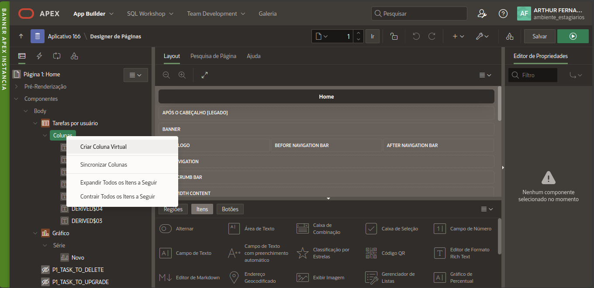

<div align="center">
 <h1> Aplicação Oracle APEX </h1>
<h2>Monitoramento de atividades</h2>
<p>Este arquivo contém a apresentação de um projeto de monitoramento de atividades utilizando APEX</p>
</div>

# Sumário
* [Apresentação](#Apresentação)
   * [Página Home](#Página-Home)
   * [Página Overview](#Página-Overview)
   * [Página de usuários](#Página-de-usuários)
      * [Formulário para criação de um usuário](#Formulário-para-criação-de-um-usuário)
   * [Página de Tarefas](#Página-de-Tarefas)
      * [Formulário para criação de uma tarefa](#Formulário-para-criação-de-uma-tarefa)
   * [Página de pesquisa tarefas usuários](#Página-de-pesquisa-tarefas-usuários)
      * [Formulário para criação de uma tarefa para um usuário](#Formulário-para-criação-de-uma-tarefa-para-um-usuário)
   * [Exemplo de login com usuário de Role USER](#Exemplo-de-login-com-usuário-de-Role-USER-Exemplo-de-login-com-usuário-de-Role-USER)

* [Como foi feito? (Pontos interessantes)](#Como-foi-feito?-(Pontos-interessantes))
   * [Autenticação personalizada](#Autenticação-personalizada)
   * [Criação de botões na tabela](#Criação-de-botões-na-tabela)
   * [Autorização personalizada](#Autorização-personalizada)


# Apresentação

## Tela de Login

*__Aqui já não é utilizado o login que vem por padrão do Oracle APEX, foi criado uma autenticação personalizada, onde será mostrado posteriormente.__*

## Página Home

_Esta é a página  após fazer o login. Nela é possível visualizar as tarefas APENAS do usuário. Temos também um gráfico para ter uma forma mais intuitiva de saber como estão o andamento das atividades._
_Na tabela temos 3 botões, sendo eles (esquerda para direita):_
* 'Upgrade' no status da tarefa (Fazer -> Fazendo)
* 'Downgrade' no status da tarefa (Fazendo -> Fazer)
*  Deletar a tarefa
**As tarefas podem ter três tipos de status (Fazer, Fazendo e Feito)**

## Página Overview

Nesta página podemos visualizar as tarefas de todos os usuários e também temos o gráfico com o mesmo objetivo da Home, porém para todos os usuários.
Nela temos duas regiões: uma para cartões e outra para o gráfico.

## Página de usuários

Aqui temos uma tabela que mostra todos os usuários do sistema. Temos também um botão para criar um usuário que é disponível apenas para usuários com 'Role' = 'ADMIN'.
Note que também é possível editar informações de uma linha (Disponível apenas para ADMIN).

### Formulário para criação de um usuário

É uma página modal que abre com o modo 'gaveta' e nela temos um formulário.

## Página de Tarefas

Aqui temos uma tabela que mostra todas as tarefas do. Temos também um botão para criar uma tarefa que é disponível apenas para usuários ADMIN.
Note que também é possível editar informações de uma linha (Disponível apenas para ADMIN).

### Formulário para criação de uma tarefa

É uma página modal que abre com o modo 'diálogo' e nela temos um formulário.

# Página de pesquisa tarefas usuários

Aqui temos uma tabela que mostra todas as tarefas de cada usuário. Temos também um botão para criar uma tarefa para um usuário que é disponível apenas para usuários ADMIN.
E por fim, temos do lado esquerdo um painel com filtros para pesquisa.

### Formulário para criação de uma tarefa para um usuário


# Exemplo de login com usuário de Role USER

Note que agora está logado com usuário 'JHON' e a página de usuários não tem o botão de criar e nem de editar linha da tabela.

# Como foi feito? (Pontos interessantes)

## Autenticação personalizada
Nos **componentes compartilhados** temos a parte de **Esquemas de Autenticação**:

Nele, podemos criar um esquema autenticado:

Na criação, colocamos um nome e tipo personalizado.

Além disso, precisamos de uma função SQL para fazer o tratamento do login.

Função que eu utilizei:
```sql
FUNCTION user_aut (
    p_username IN VARCHAR2,
    P_password IN VARCHAR2
)
RETURN BOOLEAN
AS
lc_pwd_exit VARCHAR2 (1);
BEGIN
SELECT 'Y'
INTO lc_pwd_exit
FROM ARTHURFC_MY_USERS
WHERE upper(USERNAME) = UPPER(p_username) AND PASSWORD = standard_hash(p_password, 'MD5') and status= 'Y'
;
RETURN TRUE;
EXCEPTION
WHEN NO_DATA_FOUND
THEN
RETURN FALSE;
END user_aut;
```
Também criei uma tabela específica para armazenar os dados dos usuários.

Note que para a coluna **PASSWORD** foi feito uma **criptografia** da senha.
Podemos ver na função SQL anterior o uso dela para comparar as senhas.

## Criação de botões na tabela
É possível criar colunas virtuais na tabela.


### Colocando o ícone
Alteramos o tipo da coluna.

Com a ajuda do site **button builder oracle apex** conseguimos o código HTML do botão:

Exemplo:
```HTML
<button type="button" title="Upgrade" aria-label="Upgrade" data-upgrade-id="#ID#"
        class="t-Button t-Button--noLabel t-Button--icon t-Button--hot t-Button--success t-Button--simple cc-upgrade-btn">
        <span aria-hidden="true" class="t-Icon fa fa-arrow-circle-up"></span>
</button>
```
Além disso também é preciso criar um item de página que será usado nas ações dinâmicas.
Vídeo com tutorial completo: https://www.youtube.com/watch?v=dIEcPYAI9qI&t=993s

## Autorização personalizada
Novamente em **Componentes compartilhados** temos **Esquemas de autorização**

Aí podemos também criar uma autorização personalizada.

Colocar um nome, tipo de esquema e a consulta SQL.

Minha consulta SQL:
```sql
SELECT ROLE 
FROM "ARTHURFC_MY_USERS" 
WHERE UPPER(USERNAME) = V('APP_USER') AND ROLE IN ('ADMIN')
```
Agora na página em que deseja aplicar essa autorização. Escolha o componente e em **Segurança** escolha a autorização.


